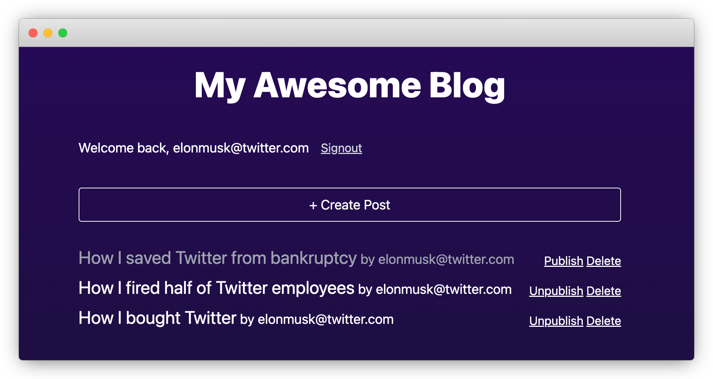

# Replacing Google Firebase - An Open-Source Alternative Stack


In the past month or so, Google managed to piss off two distinct groups of people. The first group who manage domain names, either for their employers or themselves, are hit by a surprise attack from Google’s [selling its domain service to SquareSpace](https://support.google.com/domains/answer/13689670?hl=en). The other group is digital marketers who are forced to [switch from Universal Analytics to Google Analytics V4](https://blog.google/products/ads-commerce/upgrade-to-google-analytics-4-before-july-1/), which is said to be “unbelievably hard to use”.

Since Google has [a good tradition of killing products](https://killedbygoogle.com/), we can’t help but wonder who’ll be the next. Will it be … Firebase 🤔?

<!--truncate-->

This post is a forecast of when Firebase will enter Google Graveyard. In fact, Firebase was groundbreaking in its inception showing the world what a Backend-as-a-Service is and still a great tool today. A decade later, we have a bunch of alternatives. People familiar with the domain probably already knew Supabase - the popular Postgres-based BaaS initially positioned as a Firebase alternative. Today let’s review another substitution that consists of a composition of multiple popular OSS projects:

- [Next.js](https://nextjs.org/) - a full-stack framework for building web apps using React.js
- [NextAuth](https://next-auth.js.org/) - open-source authentication framework
- [Prisma](https://prisma.io/) - next-generation Node.js/Typescript ORM
- [ZenStack](https://zenstack.dev/) - supercharges Prisma with a powerful access control layer

To facilitate the comparison between the two solutions, I’m going to use a simple blogging app as a reference:



The business requirements are:

1. Email/password-based sign-in/signup.
1. Users can create posts for themselves.
1. Post owners can update/publish/unpublish/delete their own posts.
1. Users cannot make changes to posts that do not belong to them.
1. Published posts can be viewed by all logged-in users.

The review will focus on comparing the following aspects:

  - 🆔 **Authentication**
  - ✍🏻 **Data modeling**
  - 🔐 **Access control**
  - 👩🏻‍💻 **Frontend data query**

Let’s get started.

## Authentication

Firebase provides an authentication service that supports a rich set of identity providers. An email/password-based authentication is fairly straightforward as Google’s backend services handle most of the work for us:

```ts
import { getAuth, signInWithEmailAndPassword } from 'firebase/auth';

const auth = getAuth();

async function onSignin(email: string, password: string) {
  try {
    await signInWithEmailAndPassword(auth, email, password);
    Router.push('/');
  } catch (err) {
    alert('Unable to sign in: ' + (err as Error).message);
  }
}
```

Using Next.js + NextAuth for authentication requires a bit more work, mainly because you need to set up a storage backend to persist user accounts. We’re using PostgreSQL + Prisma for the data layer, so we must first define the related data schemas. For brevity, I’ve only shown the “User” model below and skipped the “Account” and “Session” models.

```zmodel
model User {
  id            String    @id @default(cuid())
  name          String?
  email         String?   @unique
  emailVerified DateTime?
  image         String?
  accounts      Account[]
  sessions      Session[]
}

model Account { ... }

model Session { ... }
```

The next step is to install the authentication backend as an API route in Next.js:

```ts
import NextAuth, { type NextAuthOptions } from 'next-auth';
import { PrismaAdapter } from '@next-auth/prisma-adapter';
import CredentialsProvider from 'next-auth/providers/credentials';
import { prisma } from '../../../server/db';
import type { PrismaClient } from '@prisma/client';

export const authOptions: NextAuthOptions = {
  ...
  adapter: PrismaAdapter(prisma),
  providers: [
    CredentialsProvider({
      credentials: {
        email: { type: 'email'},
        password: { type: 'password' },
      },
      authorize: authorize(prisma),
    }),
  ],
};

function authorize(prisma: PrismaClient) {
  return async (
    credentials: Record<'email' | 'password', string> | undefined
  ) => {
    // verify email password against database
    ..
  };
}

export default NextAuth(authOptions);
```

With these in place, the frontend part is quite simple:

```ts
import { signIn } from "next-auth/react";

async function onSignin(email: string, password: string) {
  const result = await signIn("credentials", {
    redirect: false,
    email,
    password,
  });

  if (result?.ok) {
    Router.push("/");
  } else {
    alert("Sign in failed");
  }
}
```

### Comparison

Firebase authentication looks easy on the surface, but it doesn’t come without limitations. The main problem is that its user storage is separate from the application’s primary storage - Firestore. As a result, you can only set very few fixed attributes on a user, and a user’s profile is only accessible by herself. To break free from the limitation, you’ll need to use Cloud Functions to listen to user signup events and create separate user documents in Firestore, and a bunch of complexity is coming back.

## Data Modeling

Well, this is the most controversial topic. Schema or schema-less? SQL or NoSQL? Tough choices.

Firebase is a schema-less NoSQL database, which effectively means there’s no formal data modeling. However, it doesn’t mean there’re no hard decisions to make when it comes to relational data:

- Do you model them as nested documents?
- Or subcollections?
- Or sibling top-level collections?
- When you inevitably need to join data, do you rely on denormalization, or do you do multiple fetches and data assembly in Cloud Functions?

Each choice makes some operations easier but others a lot harder, mostly due to lacking a native “join” feature.

Back to our blog app, in Firestore, we’ll model User and Post with two separate top-level collections with the following shapes (using the denormalization approach):

```ts
// just a mental model in your head since Firestore is schema-less

// "users" collection
type User {
  id: string;    // references uid on the Firebase auth side
  email: string; // duplicated from Firebase auth
  createdAt: Date;
  updatedAt: Date;
}

// "posts" collection
type Post {
  id: string;          // auto id
  authorId: string;    // post author's uid
  authorEmail: string  // author email denormalized
  title: string;
  published: boolean;
  createdAt: Date;
  updatedAt: Date;
}
```

In our alternative stack, when using Prisma ORM with a relational database, you do explicitly modeling with a formal schema:

```zmodel title="schema.prisma"

model User {
  id            String    @id @default(cuid())
  name          String?
  email         String?   @unique
  posts Post[]
  ...
}

model Post {
  id String @id() @default(cuid())
  createdAt DateTime @default(now())
  updatedAt DateTime @updatedAt()
  title String
  published Boolean @default(false)
  author User @relation(fields: [authorId], references: [id])
  authorId String
}
```

### Comparison

The benefit of using a schema-less database is obvious - getting started is quick. You write whatever data you want from your code, and the data store happily accepts them without requiring you to define a model up front. However, the need for modeling relational data is there, regardless you do it formally or not. When using a data store like Firestore, the schema is in your head, and this brings many problems down the road:

1. As your app evolves, the schema drifts, and you end up having many versions of the same data in the store, and you need to deal with resolving the differences in code.
1. Since there’re no formal relationships, there’s no integrity checking, and it’s easy to have dangling pointers in your dataset. Again, you need to avoid or handle them in the code carefully.
1. Join is unnatural but unavoidable, and sadly you’ll find yourself needing more and more joins as your app grows.

Back to the critical choice of SQL vs. NoSQL. Here’s my take:

- An unambiguous schema is essential for the success of any non-trivial application. You either let the data store enforce it or somehow manage it yourself.
- Relational databases are much stronger than years ago in terms of scalability. They’ll probably never become as “web-scale” as NoSQL databases, but you should ask yourself if you have a “web-scale” problem and you surely want to pay the price.
- The coding flexibility offered by schema-less databases is a lie. It brings much more inefficiency than resolves.

More and more people share the same belief, and that’s why we’re having a relational database renaissance.

## Access Control

Firebase pioneered integrating access control into the datastore and exposing it directly to the internet. It did it quite successfully. You use security rules to express the CRUD permissions of documents. The security part has a tight integration with Firebase authentication so that you can reference the current user’s identity in the rules.
The business requirements of our blog app can be modeled as follows:

```ts
rules_version = '2';

service cloud.firestore {
  match /databases/{database}/documents {
    match /posts/{post} {
      // published posts are readable to all login users
      allow read: if request.auth != null && resource.data.published == true;

      // all posts are readable to their author
      allow read: if request.auth != null && request.auth.uid == resource.data.authorId;

			// login users can create posts for themselves
      allow create: if request.auth != null && request.auth.uid == request.resource.data.authorId;

      // login users can update posts but cannot change the author of a post
      allow update: if request.auth != null
      	&& request.auth.uid == resource.data.authorId
      	&& request.resource.data.authorId == resource.data.authorId;

			// login users can delete their own posts
      allow delete: if request.auth != null
      	&& request.auth.uid == resource.data.authorId;
    }
  }
}
```

Our alternative solution uses ZenStack to deal with the access control part. ZenStack is a toolkit built above Prisma and extends its schema to support modeling permissions, similar to Firestore security rules.

```zmodel title="schema.zmodel"
model Post {
  id String @id @default(cuid())
  createdAt DateTime @default(now())
  updatedAt DateTime @updatedAt
  title String
  published Boolean @default(false)
  author User @relation(fields: [authorId], references: [id])
  authorId String

  // published posts are readable to all login users
  @@allow('read', auth() != null && published)

  // all posts are readable to their author
  @@allow('read', auth() == author)

  // users can create posts for themselves
  @@allow('create', auth() == author)

  // author can update posts but can't change a post's author
  @@allow('update', auth() == author && auth() == future().author)
}
```

You can then create an “enhanced” Prisma client that enforces these rules at runtime.

### Comparison

On the surface, the two approaches look similar, and in fact, ZenStack’s policy rules are greatly inspired by Firebase. However, there’re two key differences:

1. Firebase security rules are not implicit filters, while ZenStack’s are.

    If you query the entire “posts” collection in Firestore naively like:

    ```ts
    const posts = await getDocs(query(collection(db, 'posts')));
    ```

    You’ll get a rejection because Firebase determines the result set violates “read” rules. You are responsible for adding filters on the client side to ensure the query fully complies with the rules. You’re basically duplicating the rules, and potentially in many places.

    While ZenStack’s policies are automatic read filters, and the following query returns posts that should be readable to the current user:

    ```ts
    const posts = await db.Post.findMany();
    ```

1. Firestore security rules “belong” to Firestore, while ZenStack access policies “belong” to the source code.

    People often modify their Firestore security rules in the admin console. Those with better processes keep the rules in source code and deploy them to Firebase during CI. However, even with that, the rules take some time to propagate and won’t take effect immediately. They mostly feel like they belong to the Firebase service side, not your application.

    On the contrary, ZenStack’s policy rules are an integral part of Prisma’s data schema, which is an essential part of your source code. You version control it with application code and deploy it with them.

## Frontend Data Query

One of the greatest benefits of using Firebase is that thanks to the security rules, you can manipulate the database directly from the client side, saving the need to have a backend service that wraps CRUD operations. Queries and mutations are very straightforward:

```ts
const posts = await getDocs(
  query(collection(db, 'posts'),
    or(
	  where("published", "==", true),
	  where("authorId", "==", user.uid)))
);
```

However, in a modern frontend, you usually want to use a data query library like SWR or TanStack Query to help you manage state, cache, and invalidation. Integrating them is also not difficult; here’s an example with SWR:

```ts
export function Posts(user: User) {
  const fsQuery = query(
    collection(db, 'posts'),
	  or(
	    where("published", "==", true),
		where("authorId", "==", user.uid)));

  const { data: posts } = useSWR("posts", async () => {
    const snapshot = await getDocs(fsQuery);
    const data = snapshot.docs.map((doc) => ({
      id: doc.id,
      ...doc.data(),
    }));
    return data;
  });

  return <ul>{posts?.map((post) => (<Post key={post.id} data={post} />))}</ul>;
}
```

In our alternative solution, we can achieve a better result using Next.js + ZenStack. First, install an automatic CRUD API provided by ZenStack as a Next.js API route:

```ts title="src/pages/api/model/[...path].ts"
import { enhance } from "@zenstackhq/runtime";
import { NextRequestHandler } from "@zenstackhq/server/next";
import type { NextApiRequest, NextApiResponse } from "next";
import { getServerAuthSession } from "../../../server/auth";
import { prisma } from "../../../server/db";

async function getPrisma(req: NextApiRequest, res: NextApiResponse) {
  const session = await getServerAuthSession({ req, res });
  // create a wrapper of Prisma client that enforces access policy
  return enhance(prisma, { user: session?.user });
}

export default NextRequestHandler({ getPrisma });
```

Then enable the SWR plugin in the data schema to generate client query hooks for our models:

```zmodel title="schema.zmodel"
plugin hooks {
  provider = '@zenstackhq/swr'
  output = "./src/lib/hooks"
}
```

Then use the hooks to query from the client side:

```ts
import { useFindManyPost } from "../lib/hooks";

export function Posts(user: User) {
  // you can use the "include" clause to join the "User" table really easy
  const { data: posts } = useFindManyPost({ include: { author: true } });

  // posts is automatically typed as `Array<Post & { author: User }>`
  return <ul>{posts?.map((post) => (<Post key={post.id} data={post} />))}</ul>;
}
```

### Comparison

Both solutions allow to manipulate data directly from the frontend, but there’re some important differences:

- Need of filtering

    As mentioned in the previous section, since ZenStack’s policy rules act like implicit filters, you don’t need to duplicate the rules in the query code.

- Type-safety

    Firebase is schema-less, so there’s no way of generating or inferring model types. You either don’t do typing at all or manually declare types based on your understanding of the data shapes. Prisma’s schema is strongly typed so that ZenStack can generate fully type-safe model types and hooks code, even for the dynamically included relational query (the “author” field).

- Relational query

    Since there’s no “join” in Firestore, we had to denormalize and duplicate the author’s email in the “posts” collection to render it. However, for Prisma and relational databases, joining is like a basic instinct; you can do it naturally.

## Conclusion

Firebase was a great innovation and is still an excellent tool today. However, many things have changed in the past decade. When Firebase was born, TypeScript was still in its infancy, and ORMs were a rare thing. Now we’re equipped with much better tooling and very different mindsets. It’s a good time to try out something different.
