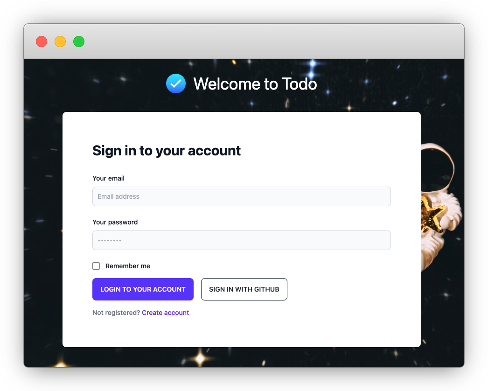

import Requirements from '../_components/_todo-requirements.md';

# ZenStack: The Complete Guide

## Introduction

Welcome to *The Complete Guide of ZenStack*. This guide is designed to systematically introduce the key concepts in ZenStack and guide you through how to use its essential features.

## Sample Project

Throughout the guide, we'll learn the key concepts and features by gradually building a sample project. The project is a multi-tenant Todo app, which allows users to create and join "Spaces", and collaborate with users in the same space by creating and managing Todo Lists.

Here are the detailed requirements:

<Requirements />

The app is not too complex but covers many important aspects of a modern multi-tenant web application. You can find the complete source code of the project at [https://github.com/zenstackhq/the-complete-guide-sample/tree/v1](https://github.com/zenstackhq/the-complete-guide-sample/tree/v1). It contains several branches, each corresponding to the end state of a part of the guide. For example, you can use branch "part1" as the starting point of your study of Part II.

:::info Hands-on indicator

Many chapters include hands-on sections where we gradually build the sample project. They are all marked with 🛠️ symbol.

:::

You can have a preview of the fully completed version below:

## Organization

ZenStack consists of several layers of functionalities, each depends on the previous one. These layers are explained in detail in the following four parts. In each part, we'll add more functionalities to our Todo app and eventually finish it by the end of the guide.

### Part I: Supercharged ORM

The first layer works as an extension to Prisma ORM - both for the schema language and the runtime PrismaClient. We made several extensions to the Prisma Schema Language to make it possible to express more than just the database schema. For example, you can attach access policies to the data models. At runtime, ZenStack creates a transparent proxy around PrismaClient to add extra behavior to it - one of the best examples is the automatic access control enforcement.

The extension to Prisma ORM is the foundation of ZenStack and enables all other features above it. These features are also agnostic to the framework you use for the backend. It's simply a drop-in replacement for Prisma.

In this part of the guide, we'll finish building the schema of the sample project - including the data models, access policies, and data validation rules. There's no API or UI yet, but the business logic will be mostly complete.

[Go to Part I](./part1)

### Part II: Plugin System

ZenStack adopts a plugin-based architecture for great extensibility. The plugin system allows you to add new features to ZenStack without modifying the core codebase. In fact, most built-in features of ZenStack are implemented as plugins.

In this part of the guide, you'll see how to use plugins to achieve various goals, and we'll also build a simple plugin for our Todo app from scratch.

[Go to Part II](./part2)

### Part III: Automatic CRUD API

Developers build APIs to support the client side of their applications. One of the most common type of APIs is CRUD - Create, Read, Update, and Delete. Building CRUD APIs is a tedious task but error-prone at the same time.

Since ZenStack already secures data access at the ORM layer, as we learned from the previous part, it can automatically generate CRUD APIs for you. You'll learn about the details in this part of the guide.

In this part of the guide, we'll add a CRUD API layer to our Todo app and turn it into a fully functional backend service.

[Go to Part III](./part3)

### Part IV: Frontend Data Query

Modern web apps often use data query libraries (like [TanStack Query](https://tanstack.com/query) and [SWR](https://swr.vercel.app/)) to fetch data from the backend. These libraries help you build reactive data binding UI with ease.

ZenStack can generate hooks code that talks to the automatic CRUD API introduced in the previous part, targeting these libraries. The hooks help you implement front-end data queries with minimum code and complete type safety. Part IV focuses on this topic.

In this part of the guide, we'll use the generated data query hooks to build a frontend UI for our Todo app. We'll finally complete our full-stack Todo application!

[Go to Part IV](./part4)
