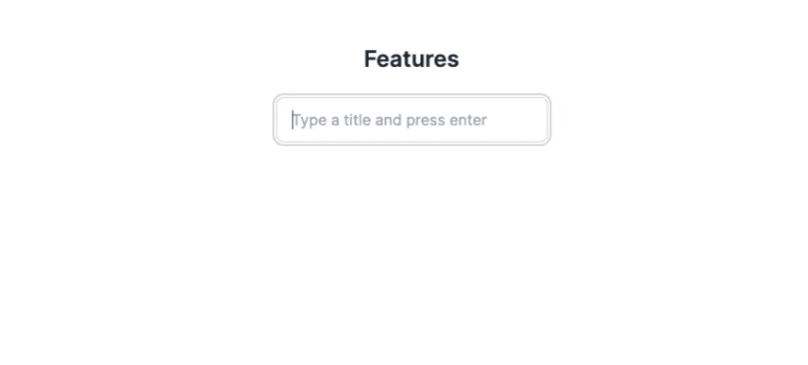
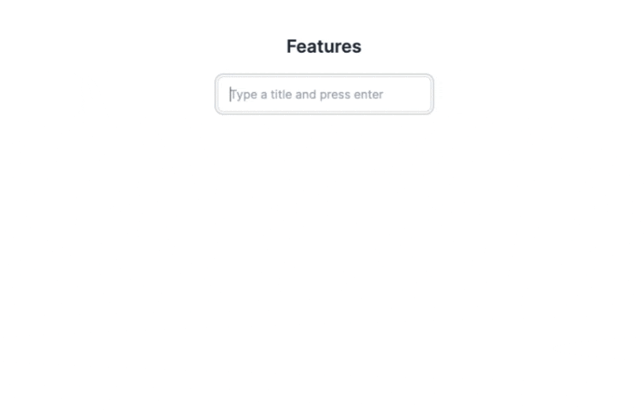

# Optimistic Update

Optimistic update is a technique that allows us to update the UI immediately after a user action without waiting for the server response. It's a great way to improve the perceived performance of an application and is especially useful for the parts where users interact with the UI frequently.

Libraries like TanStack Query and SWR provides the framework for developers to implement optimistic update. The approach is essentially to update the query cache immediately after the user action and revert or invalidate the cache after the server response comes back (either success or error). However, similar to the query invalidation problem we discussed in the previous chapter, the challenge is identifying which queries need to be updated and how.

ZenStack supports automatic optimistic update for the hooks it generates. It uses a set of rules to update queries and aims to cover the most common use cases. You can find more on how it works [here](/docs/reference/plugins/tanstack-query#details-of-the-optimistic-behavior).

:::info Automatic optimistic update is an approximation

It's often impossible to accurately determine the correct way to update a query cache from the frontend. For example, you may have a query that fetches a filtered list of Todos using the `useFindManyTodo()` hook. When creating a new Todo, we can't precisely determine if the new item should be inserted into the query result (i.e., matching the filter conditions) without querying the database. But paradoxically, the update is no longer optimistic if we query the database.

ZenStack takes an "optimistic" action here and inserts the new Todo into the query result. It's not always correct, but the worst-case scenario is that the item shows up on the list for a short while until the query is invalidated upon getting the server response.

:::

### 🛠️ Adding Todo Management

The main missing part of our sample app is managing Todos in a List. This is a great place to implement optimistic update because users may add, update, or delete Todos in quick paces, and waiting for the server response to update the UI will result in a very sluggish experience.

Let's first implement the Todo management UI without optimistic update. First, create a component `src/components/TodoComponent.tsx` to manage one single Todo:

```tsx title="src/components/TodoComponent.tsx"
import type { Todo } from "@prisma/client";
import { useDeleteTodo, useUpdateTodo } from "~/lib/hooks";

type Props = {
  value: Todo;
  optimistic?: boolean;
};

export default function TodoComponent({ value, optimistic }: Props) {
  const update = useUpdateTodo();
  const del = useDeleteTodo();

  function onDelete() {
    del.mutate({ where: { id: value.id } });
  }

  function onToggleCompleted(completed: boolean) {
    if (completed === !!value.completedAt) {
      return;
    }
    update.mutate({
      where: { id: value.id },
      data: { completedAt: completed ? new Date() : null },
    });
  }

  return (
    <div className="flex w-96 flex-col items-center rounded-lg border px-8 py-4">
      <div className="flex w-full justify-between">
        <h3
          className={`flex items-center text-xl
                        ${
                          value.completedAt
                            ? "italic text-gray-400 line-through"
                            : "text-gray-700"
                        }
                    }`}
        >
          {value.title}
          {optimistic && (
            <span className="loading loading-spinner loading-sm ml-1"></span>
          )}
        </h3>
        <div className="flex">
          <input
            type="checkbox"
            className="checkbox mr-2"
            checked={!!value.completedAt}
            onChange={(e) => onToggleCompleted(e.currentTarget.checked)}
          />
          <button className="btn btn-ghost btn-xs" onClick={onDelete}>
            Delete
          </button>
        </div>
      </div>
    </div>
  );
}
```

Then, create a page at `src/app/spaces/[slug]/[listId]/page.tsx` to manage Todos in a List:

```tsx title="src/app/spaces/[slug]/[listId]/page.tsx"
"use client";

import { useSession } from "next-auth/react";
import { useParams } from "next/navigation";
import { useState } from "react";
import TodoComponent from "~/components/TodoComponent";
import { useCreateTodo, useFindManyTodo, useFindUniqueList } from "~/lib/hooks";

export default function TodoList() {
  const { listId } = useParams<{ listId: string }>();
  const { data: session } = useSession();

  const { data: list } = useFindUniqueList(
    {
      where: { id: listId },
    },
    { enabled: !!session?.user },
  );

  const { mutate: create } = useCreateTodo();
  const { data: todos } = useFindManyTodo(
    {
      where: { listId },
      orderBy: { createdAt: "desc" as const },
    },
    { enabled: !!session?.user },
  );

  const [title, setTitle] = useState("");

  function onCreate() {
    create({
      data: {
        title,
        owner: { connect: { id: session?.user.id } },
        list: { connect: { id: listId } },
      },
    });
    setTitle("");
  }

  if (!session?.user || !list) {
    return <></>;
  }

  return (
    <div>
      <div className="container mx-auto flex w-full flex-col items-center py-12">
        <h1 className="mb-4 text-2xl font-semibold">{list.title}</h1>
        <div className="flex space-x-2">
          <input
            type="text"
            placeholder="Type a title and press enter"
            className="input input-bordered mt-2 w-72 max-w-xs"
            value={title}
            autoFocus
            onKeyUp={(e) => {
              if (e.key === "Enter") {
                onCreate();
              }
            }}
            onChange={(e) => {
              setTitle(e.currentTarget.value);
            }}
          />
        </div>
        <ul className="flex w-auto flex-col space-y-4 py-8">
          {todos?.map((todo) => (
            <TodoComponent
              key={todo.id}
              value={todo}
              optimistic={todo.$optimistic}
            />
          ))}
        </ul>
      </div>
    </div>
  );
}
```

To simulate usage in the real world, I've enabled Chrome's network throttling to "Fast 3G" mode. Here's what it looks like:



It's obviously very sluggish. It's not something a user wants to pay for.

Let's make some small changes to enable automatic optimistic update. In `src/pages/spaces/[slug]/[listId]/index.tsx`, change the `useCreateTodo` call to the following:

```tsx
// the three arguments are: 
//     - mutation options
//     - auto invalidate (default true)
//     - auto optimistic-update (default false)
const { mutate: create } = useCreateTodo(undefined, true, true);
```

And likewise, change the `useUpdateTodo` and `useDeleteTodo` calls in `Todo.tsx` to the following:

```tsx
const update = useUpdateTodo(undefined, true, true); // optimistic update
const del = useDeleteTodo(undefined, true, true); // optimistic update
```

Now, if we repeat the same test with network throttling, we'll see a much better experience:



:::tip Opt-out of automatic optimistic update

When you enable automatic optimistic update for a mutation, it applies to all queries that may be impacted. If this is not desirable, you can pass an extra `optimisticUpdate` argument as `false` to opt out of automatic optimistic update. For example:

```ts
const { data: todos } = useFindManyTodo(
    { where: { listId } },
    { enabled: !!session?.user },
    false, // <- opt-out automatic optimistic update
);
```

With this change, the `useCreateTodo` mutation will not optimistically update this query even if the mutation is set to do so.

:::