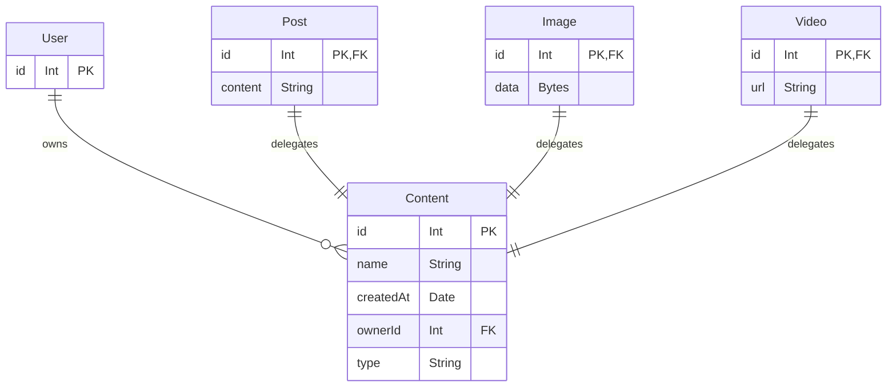

import ZModelVsPSL from '../_components/ZModelVsPSL';

# Polymorphism

<ZModelVsPSL>
Polymorphism is a ZModel feature and doesn't exist in PSL.
</ZModelVsPSL>

## Introduction

When modeling non-trivial applications, the need of an "Object-Oriented" kind of polymorphism often arises:
- Something **IS-A** more abstract type of thing.
- Something **HAS-A/HAS-many** a more abstract type of thing(s).

Imagine we're modeling a content library system where users own different types of content: posts, images, videos, etc. They share some common traits like name, creation date, owner, etc., but have different specific fields.

It may be tempting to use mixins to share the common fields, however it's not an ideal solution because:

- The `User` table will have relations to each of the content types.
- There's no efficient and clean way to query all content types together (e.g., all content owned by a user).
- Consequently, whenever you add a new content type, you'll need to modify the `User` model, and probably lots of query code too.

A true solution involves having a in-database model of polymorphism, where we really have a `Content` table that serves as an intermediary between `User` and the concrete content types. This is what ZModel polymorphism is about.

:::info
There are [two main ways](https://www.prisma.io/docs/orm/prisma-schema/data-model/table-inheritance) to model polymorphism in relational databases: single-table inheritance (STI) and multi-table inheritance (MTI, aka. "Delegate Types"). ZModel only supports MTI.
:::

## Modeling polymorphism

Modeling polymorphism in ZModel is similar to designing an OOP class hierarchy - you introduce a base model and then extend it with concrete ones.

Here's how it looks for our content library example:

```zmodel
model User {
    id       Int       @id
    contents Content[]
}

model Content {
    id        Int      @id
    name      String
    createdAt DateTime @default(now())
    owner     User     @relation(fields: [ownerId], references: [id])
    ownerId   Int
    // highlight-next-line
    type      String

    // highlight-next-line
    @@delegate(type)
}

model Post extends Content {
    content String
}

model Image extends Content {
    data Bytes
}

model Video extends Content {
    url String
}
```



There are two special things about polymorphic base model:

1. It must have a "discriminator" field that stores the concrete model type that it should "delegate" to. In the example above, the `type` field serves this purpose. It can be named anything you like, but must be of `String` or enum type.
2. It must have a `@@delegate` attribute. The attribute serves two purposes: it indicates that the model is a base model, and it designates the discriminator field with its parameter.

You can also have a deep hierarchy involving multiple level of base models. Just need to make sure each base model has its own discriminator field and `@@delegate` attribute. Extending from multiple base models directly is not supported.

## Migration behavior

The migration engine takes care of mapping both the base model and the concrete ones to tables, and creates one-to-one relations between the base and each of its derivations.

To simplify query and conserve space, the base and the concrete are assumed to share the same id values (this is guaranteed by the ORM when creating the records), and consequently, the concrete model's id field is also reused as the foreign key to the base model. So, for a `Post` record with id `1`, the base `Content` record also has id `1`.

## ORM behavior

The ORM hides the delegate complexities and provides a simple polymorphic view to the developers:

1. Creating a concrete model record automatically creates the base model record with the same id and proper discriminator field.
2. Querying with the base model will return entities with concrete model fields.

We'll revisit the topic in details in the [ORM](../orm/polymorphism.md) part.
