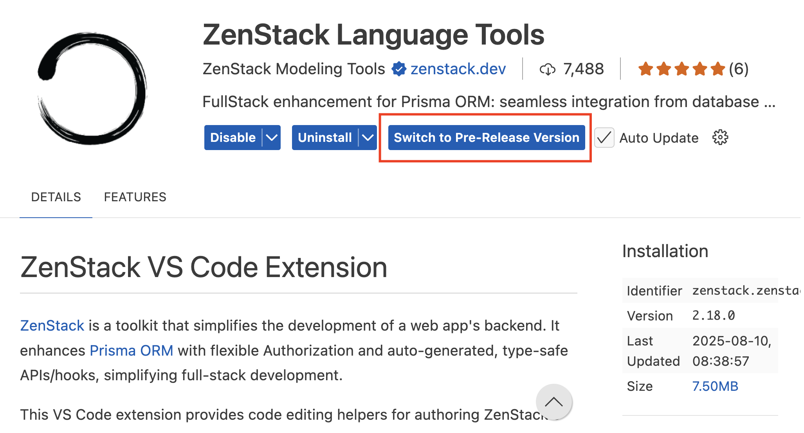

# Prerequisite

## Node.js

Node.js v20 or above.

## TypeScript

TypeScript v5.8.0 or above.

## IDE Extension

If you use VSCode, please install the [ZenStack VSCode Extension](https://marketplace.visualstudio.com/items?itemName=zenstack.zenstack) for syntax highlighting, auto-completion, and error reporting. Make sure you switch to the prerelease version that's compatible with v3.

Other IDEs are not supported at this time.
