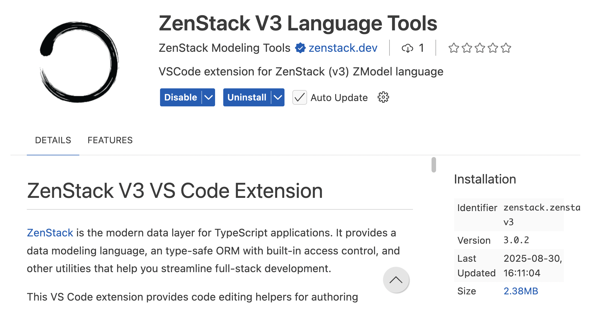

# Prerequisite

## Node.js

Node.js v20 or above.

## TypeScript

TypeScript v5.8.0 or above.

## IDE Extension

If you use VSCode, please install the [ZenStack V3 VSCode Extension](https://marketplace.visualstudio.com/items?itemName=zenstack.zenstack-v3) for syntax highlighting, auto-completion, and error reporting.



If you use both ZenStack v2 and v3 in different projects, you can install the original [ZenStack VSCode Extension](https://marketplace.visualstudio.com/items?itemName=zenstack.zenstack) side-by-side with the v3 extension. The two extensions have different language ids (v2: `zmodel`, v3: `zmodel-v3`) but handle the same `.zmodel` file extension. To avoid conflicts, make sure you specify the language id explicitly in the `.vscode/settings.json` file in your project:

```json
{
  "files.associations": {
    "*.zmodel": "zmodel-v3" // use "zmodel" for ZenStack v2 projects
  }
}
```

Other IDEs are not supported at this time.
