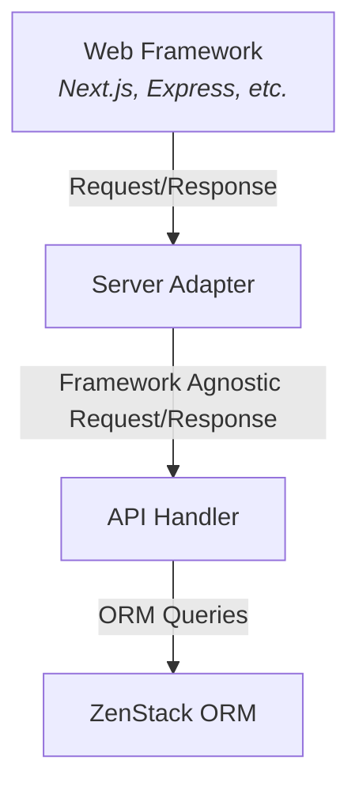

# Server Adapter

## Overview

Server adapters are components that handle the integration with specific frameworks. They understand how to install API routes and handle framework-specific request and response objects.

Server adapters need to be configured with an API handler that define the API specification. The following diagram illustrates the relationship between them:

## Example

## Catalog

ZenStack currently maintains the following server adapters. New ones will be added over time based on popularity of frameworks.

- [Next.js](../reference/server-adapters/next)
- [Nuxt](../reference/server-adapters/nuxt)
- [SvelteKit](../reference/server-adapters/sveltekit)
- [TanStack Start](../reference/server-adapters/tanstack-start)
- [Express.js](../reference/server-adapters/express)
- [Fastify](../reference/server-adapters/fastify)
- [Hono](../reference/server-adapters/hono)
- [Elysia](../reference/server-adapters/elysia)
