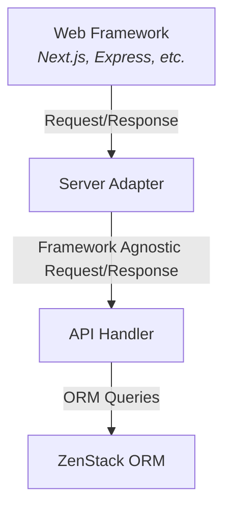

import StackBlitzGithub from '@site/src/components/StackBlitzGithub';

# Server Adapter

## Overview

Server adapters are components that handle the integration with specific frameworks. They understand how to install API routes and handle framework-specific request and response objects.

Server adapters need to be configured with an API handler that defines the API specification. The following diagram illustrates the relationship between them:

## Example

Let's use a real example to see how API handlers and server adapters work together to serve an automatic secured data query API. A few notes about the example:

- Express.js is used to demonstrate, but the same concept applies to other supported frameworks.
- Authentication is simulated by using the "x-userid" header. In real applications, you would use a proper authentication mechanism.
- ZModel schema is configured with access policies.
- For each request, the `getClient` call back is called to get an ORM client instance bound to the current user.

<StackBlitzGithub repoPath="zenstackhq/v3-doc-server-adapter" openFile="main.ts,zenstack/schema.zmodel" />

## Catalog

ZenStack currently maintains the following server adapters. New ones will be added over time based on popularity of frameworks.

- [Next.js](../reference/server-adapters/next)
- [Nuxt](../reference/server-adapters/nuxt)
- [SvelteKit](../reference/server-adapters/sveltekit)
- [TanStack Start](../reference/server-adapters/tanstack-start)
- [Express.js](../reference/server-adapters/express)
- [Fastify](../reference/server-adapters/fastify)
- [Hono](../reference/server-adapters/hono)
- [Elysia](../reference/server-adapters/elysia)
